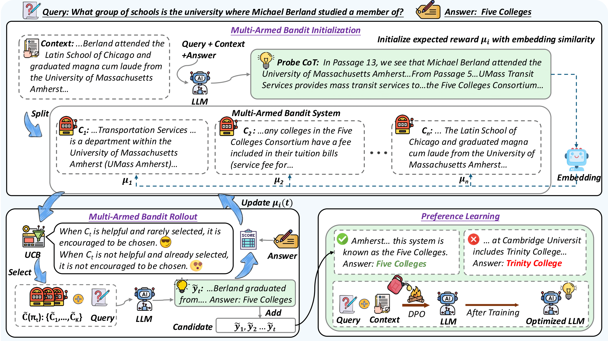

<div align="center">

<h1> Chunks as Arms: Multi-Armed Bandit-Guided Sampling for Long-Context LLM Preference Optimization </h1>

<a href='https://arxiv.org/abs/2508.13993'></a>
<a href='https://huggingface.co/collections/rocketduan/longmab-po-68a7241776ad26006038efa3'>

</div>

## Overview
LongMab-PO is a novel framework that leverages a Multi-Armed Bandit (MAB) rollout strategy to identify the most informative chunks from the given long context for sampling high-quality and diverse responses and constructing preference data pairs for Direct Preference Optimization (DPO) training.



## Set Up
Use `git clone` to download this project
```
git clone https://github.com/NEUIR/LongMab-PO.git
cd LongMab-PO
```

Create environment for training and evaluation.
```
conda create -n longmab python=3.10
conda activate longmab
pip install -r requirements.txt
```

## Training LongMab-PO
If you do not want to train the model, you can download models trained with [LongMab-PO](https://huggingface.co/collections/rocketduan/longmab-po-68a7241776ad26006038efa3) and skip this section to [Evaluation](#evaluation).

If you want to use the ready-to-use synthetic preference data directly, you can download from [here](https://drive.google.com/drive/folders/1QJ63-90RIdjyKwAdCMZKLz5KiFfxEkoq?usp=sharing) and skip this section to [DPO Training](#3-dpo-training)
### 1. Prepare the Training Data

You can follow [SeaLong](https://github.com/SihengLi99/SEALONG/tree/main) to synthesize raw training data, or download the file from [here](https://drive.google.com/drive/folders/1QJ63-90RIdjyKwAdCMZKLz5KiFfxEkoq?usp=sharing) and place them in the `data/train_data/` directory.
**Each sample must contain the following four required fields:**

```json
{
  "id": "A unique identifier for the sample (int)",
  "input": "The input question (str)",
  "answer": "The ground truth answer to the question (str)",
  "context": "The synthesized long context (str)"
}     
```

### 2. Run the LongMab-PO Pipeline
**(1) Generate Probe CoT:**
You should download the [MiniCPM-Embedding](https://huggingface.co/openbmb/MiniCPM-Embedding) to calculate the initial importance score of each chunk based on the probe cot.
```
cd scripts
bash gen_probe.sh
```
**(2) Running the Multi-Armed Bandit Rollout Process:**
```
bash rollout.sh
```
**(3) Construct Preference Data Pairs:**
```
bash construct_po_data.sh
```

### 3. DPO Training
You can train the model by utilizing [LLaMA-Factory](https://github.com/hiyouga/LLaMA-Factory) framework quickly, we provide the yaml files. Please refer to LLaMA-Factory for relevant environment installation and configuration.
```
cd scripts
bash llama3_dpo.sh
bash qwen2_dpo.sh
```

## Evaluation
We provide the evalation datasets [here](https://drive.google.com/drive/folders/1QJ63-90RIdjyKwAdCMZKLz5KiFfxEkoq?usp=sharing), or you can download from [LongBench](https://huggingface.co/datasets/zai-org/LongBench) and [InfiniteBench](https://huggingface.co/datasets/xinrongzhang2022/InfiniteBench). You should place the datasets in the `data/test_data/` directory. 
```
cd scripts
bash eval.sh
```

## Acknowledgement
We gratefully acknowledge the following projects that LongMab-PO builds upon:
- [**MuSiQue**](https://github.com/StonyBrookNLP/musique)
- [**LLaMA-Factory**](https://github.com/hiyouga/LLaMA-Factory)
- [**vLLM**](https://github.com/vllm-project/vllm)

## Citation
We appreciate your citations if you find our paper related and useful to your research!
```
@misc{duan2025chunksarmsmultiarmedbanditguided,
      title={Chunks as Arms: Multi-Armed Bandit-Guided Sampling for Long-Context LLM Preference Optimization}, 
      author={Shaohua Duan and Xinze Li and Zhenghao Liu and Xiaoyuan Yi and Yukun Yan and Shuo Wang and Yu Gu and Ge Yu and Maosong Sun},
      year={2025},
      eprint={2508.13993},
      archivePrefix={arXiv},
      primaryClass={cs.CL},
      url={https://arxiv.org/abs/2508.13993}, 
}
```

## Contact Us
If you have questions, suggestions, and bug reports, please email us, we will try our best to help you.
```
2471995@stu.neu.edu.cn
```
